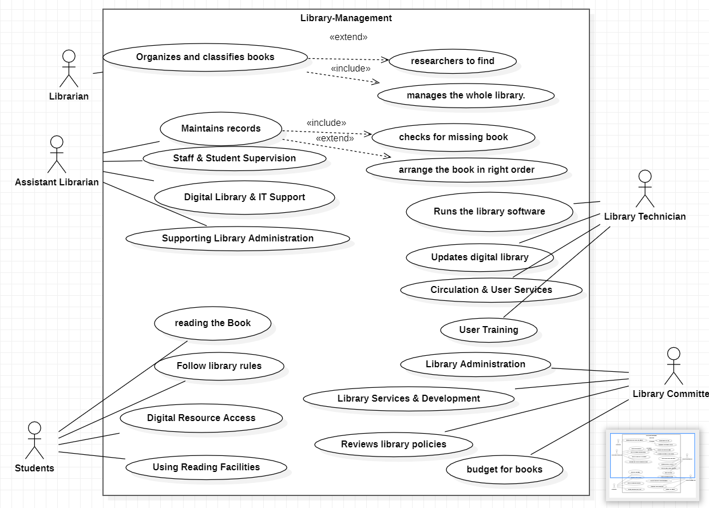
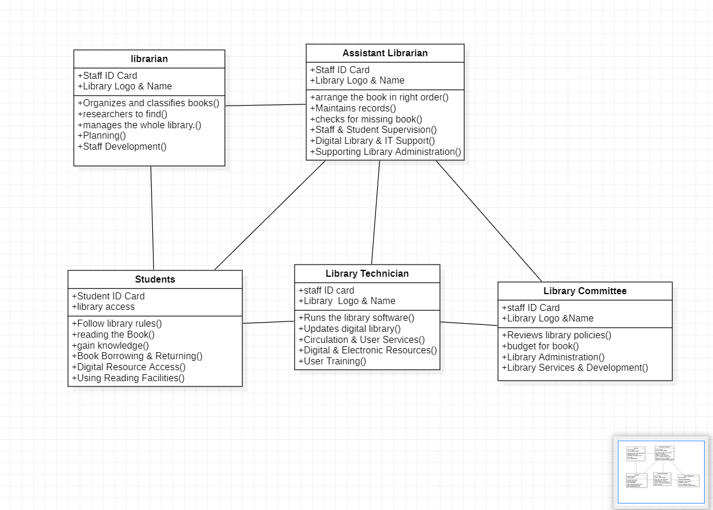
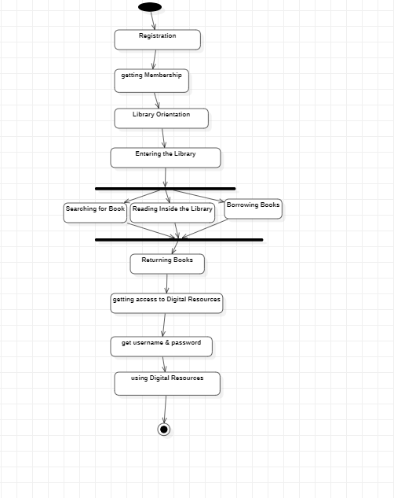
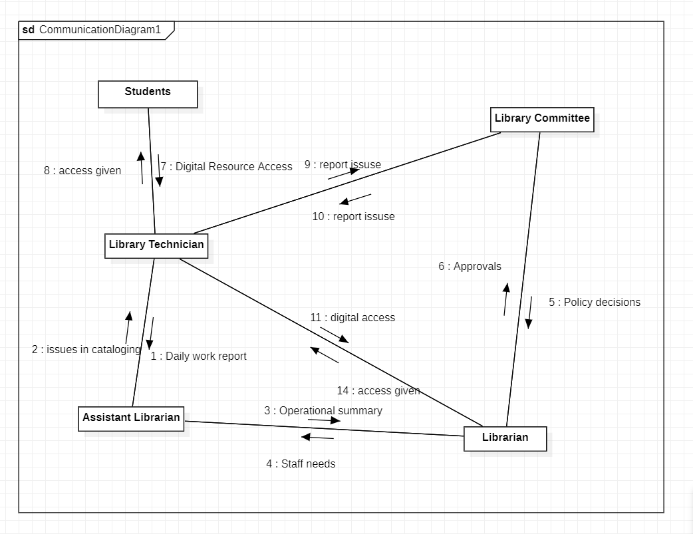
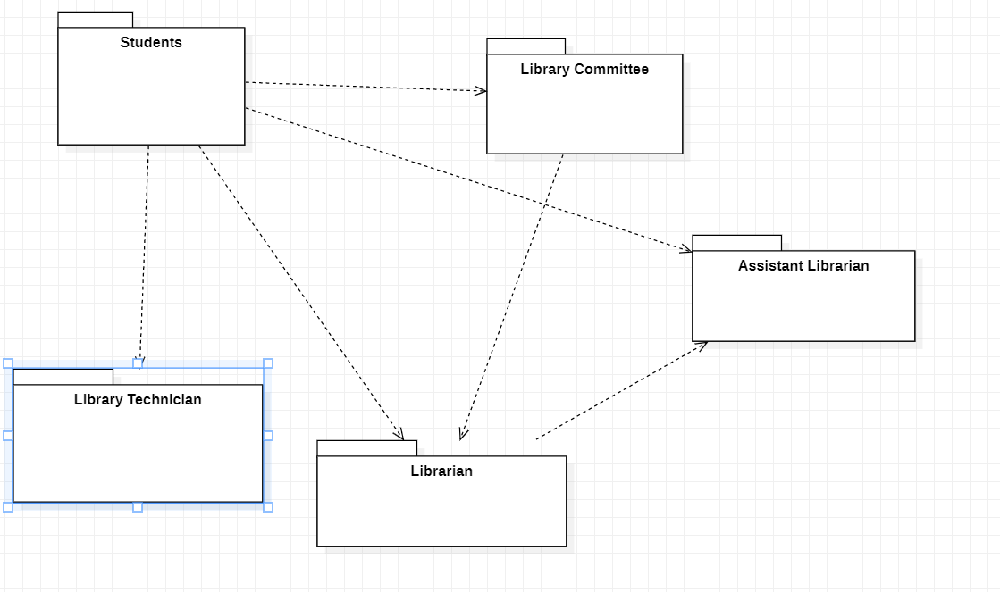
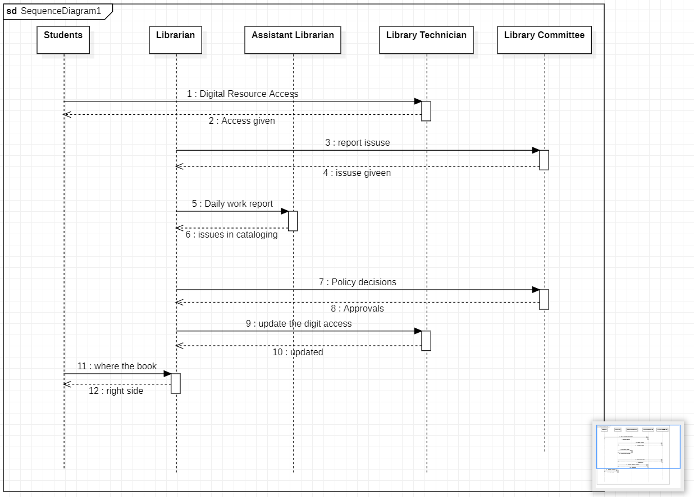

# Exp - 2 LIBRARY MANAGEMENT SYSTEM

# AIM:
To design and develop a Library Management System that automates the process of managing books, members, and transactions such as book issue and return. The system aims to maintain accurate records, reduce manual work, and improve the efficiency of library operations.

# SRS (Procedure):
Purpose:
To automate library operations like book issue, return, and record management.

Scope:
Used by Admin, Librarian, and Students to manage books and user records efficiently.

Functional Requirements:

Login for users

Add/search books

Issue and return books

Fine calculation

Generate reports

Non-Functional Requirements:

Secure, fast, and user-friendly system

# DIAGRAMS:
(upload all 6 diagrams)
## USE CASE DIAGRAM:

## CLASS DIAGRAM:

## ACTIVITY DIAGRAM:

## COMMUNICATION DIAGRAM:

## PACKAGE DIAGRAM:

## SEQUENCE DIAGRAM:

# RESULT:
The Library management system is successfully analyzed, and its architecture is effectively represented using UML diagrams, providing a clear understanding of system structure and behavior.
